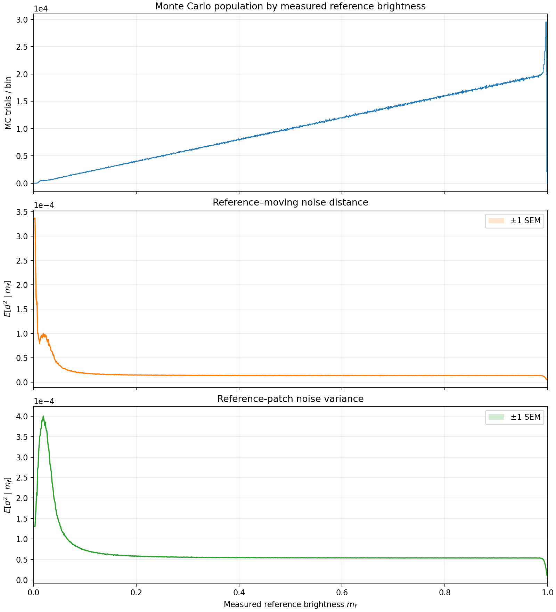

# Handheld Multi-Frame Super-Resolution

[[Paper]](https://www.ipol.im/pub/pre/460) [[Demo]](https://ipolcore.ipol.im/demo/clientApp/demo.html?id=460)

**⚠️ Update 02/09/26:This repo now diverges considerably from the online IPOL demo. Several correction have been made, some features have been added and some removed. Please try the recent code for better result**

This repository contains a non-official implementation of the “Handheld Multi-Frame Super-Resolution algorithm” paper by Wronski et al. (used in the Google Pixel 3 camera), which performs simultaneously multi-image super-resolution demosaicking and denoising from a burst of raw photgraphs. To the best of our knowledge, this is the first publicly available comprehensive implementation of this well-acclaimed paper, for which no official code has been released so far.
 
The original paper can be found [here](https://sites.google.com/view/handheld-super-res/), whereas our publication detailing the implementation is available on [IPOL](https://www.ipol.im/pub/pre/460). In this companion publication, we fill the implementation blanks of the original SIGGRAPH paper, and disclose many details to actually implement the method.
Note that our Numba-based implementation is not as fast as that of Google. It is mainly for scientific and educational purpose, with a special care given to make the code as readable and understandable as possible, and was not optimized to minimize the execution time or the memory usage as in an industrial context. Yet, on high-end consumer grade GPUs (NVIDIA RTX 3090 GPU), a 12MP burst of 20 images is expected to generate a 48MP image within less than 4 seconds (without counting Numba's just-in-time compilation), which is enough for running comparisons, or being the base of a faster implementation. 

We hope this code and the details in the IPOL publication will help the image processing and computational photography communities, and foster new top-of-the-line super-resolution approaches. Please find below two examples of demosaicking and super-resolution from a real raw burst from [this repository](https://github.com/goutamgmb/deep-rep). 


#### Post-processing

In the examples above and in our IPOL paper, we used the post-processing approach of this [repo](https://github.com/teboli/fast_two_stage_psf_correction) to remove the remaining optical aberrations on the following examples. 
Check also our publicly available implementation of **Polyblur** in this [repo](https://github.com/teboli/polyblur) to sharpen the result you get with this super-resolution code.

## Installation
> ⚠️ **Windows users:** We recommend using WSL to avoid potential issues with Numba (see issue #48).

Install the project dependencies using either `uv` or `pip`:

```bash
# uv
uv sync

# pip
python -m venv .venv
source .venv/bin/activate
python -m pip install .
```

> CUDA runtime libraries are provided by the `numba-cuda[cu13]` and `torch` packages, so a system-wide CUDA Toolkit installation is generally not required; a compatible NVIDIA driver should be sufficient. If you encounter CUDA-related issues, installing the CUDA Toolkit separately may be necessary: This can be done system-wide or through an environment manager such as Conda.
> 
> The installation uses CUDA 13. CUDA 12 should work as well; users who require it can change the dependency in `pyproject.toml` to `numba-cuda[cu12]` before installing. 


### Running the code
Place your .dng image burst in the `./test_burst/` folder. You can download some dng bursts [here](https://github.com/goutamgmb/deep-rep), or download the latest release of the code already containing test bursts. Now, simply run the code for x2 super-resolution with:
```bash
# uv
uv run handheld --impath test_burst --outpath output.png --scale 2

# pip
handheld --impath test_burst --outpath output.png --scale 2
```

Run `uv run handheld --help` or `handheld --help` to see all the options. The `--debug` flag will dump interesting intermediate results.

If noise correction is enabled (the default), you wille also need to provide the matching LUT with
`--noise-model.lut-path data/your_camera_noise.npz` (see below).

To obtain the bursts used in the publication, please download the latest release of the repo. It contains the code and two raw bursts of respectively 13 images from [[Bhat et al., ICCV21]](https://arxiv.org/abs/2108.08286) and 20 images from [[Lecouat et al., SIGGRAPH22]](https://arxiv.org/abs/2207.14671). Otherwise specify the path to any burst of raw images, e.g., `*.dng`, `*.ARW` or `*.CR2` for instance.

## DNG output

Saving as DNG uses an uncompressed 16-bit TIFF intermediate, ExifTool for
metadata, and Adobe's `dng_validate` to produce the final LinearRaw DNG.

Install ExifTool and the build dependencies:

```bash
sudo apt update
sudo apt install -y libimage-exiftool-perl build-essential gcc g++ make unzip libjpeg-dev
exiftool -ver
```

Adobe does not distribute a Linux binary for `dng_validate`. The tested route
uses the community Linux build from
[`abworrall/go-dng`](https://github.com/abworrall/go-dng):

```bash
git clone https://github.com/abworrall/go-dng.git
cd go-dng/sdk/
```
Now, try a first install
```
make CC=g++ CXX=g++
```
No need to run it until the end, we just need it to download a zip. You can now run
```
unzip dng_sdk_1_6.zip
```

The SDK validator normally attempts to generate JPEG previews, which fails for
large output images. Disable its preview loop before compiling:

```bash
sed -i 's/previewIndex < 2/previewIndex < 0/' \
  dng_sdk_1_6/dng_sdk/source/dng_validate.cpp
make CC=g++ CXX=g++
./bin/dng_validate
```

Say no when `make` asks whether to replace the already-extracted SDK files. Put
`go-dng/sdk/bin` on `PATH`, or link it:
```
sudo ln -s "$(pwd)/bin/dng_validate" /usr/local/bin/dng_validate
```

You should now be able to execute `dng_validate` from anywhere. And you can now use
```bash
# uv
uv run handheld --impath test_burst --outpath output.dng

# pip
handheld --impath test_burst --outpath output.dng
```

### Calibrating robustness noise correction

This part diverges from the IPOL paper. The key idea is that the robustness coefficient is computed based on $d$ and $\sigma$. But $d$ and $\sigma$ must have a perceptual relevance,
and therefore be derived from a relevant color-space. This is indeed what all the previosu works on TAA did in the past. We think that Wronsi et. Al applied $\sqrt{\max(x, 0)}$ to the raw color pixel, which would be coherent with prior works of the author and with our goal. Hence, the Monte-Carlo part consist in sampling two identical raw patches, add noise, and put them through the whole chain. At the end, we mesure the perceptual brightness of the 3x3 patch (average of the R, G, B channels), $d^2$ and $\sigma^2$. One example of such curve is given below.




Robustness noise correction uses a camera/profile-specific Monte Carlo LUT. Generate it from one representative DNG (the DNG `NoiseProfile` tag is read automatically):

```bash
# uv
uv run python -m handheld_super_resolution.monte_carlo \
  --dng test_burst/vk/APC_1071.dng \
  --output data/vk_sqrt_noise.npz

# pip
python -m handheld_super_resolution.monte_carlo \
  --dng test_burst/vk/APC_1071.dng \
  --output data/vk_sqrt_noise.npz
```

The profile should be estimated in a few seconds.
Beside the NPZ it writes `<name>.diagnostics.png`, containing the measured-brightness histogram and the conditional $d^2$ and $\sigma^2$ (variance) curves.
Run `uv run python -m handheld_super_resolution.monte_carlo --help` for all options.

Pass the resulting file to the reconstruction. A LUT is required whenever robustness noise correction is enabled:

```bash
# uv
uv run handheld \
  --impath test_burst/vk \
  --outpath output.png \
  --noise-model.lut-path data/vk_sqrt_noise.npz

# pip
handheld \
  --impath test_burst/vk \
  --outpath output.png \
  --noise-model.lut-path data/vk_sqrt_noise.npz
```

The loader rejects LUTs made for a different transform or a different DNG noise profile. To run without the correction, pass `--robustness.no-noise-correction`.


## About the noise profile
The method requires the camera noise profile $\alpha,\beta$. It is used both by the Monte Carlo LUT generator and by the generalized Anscombe transform.

By default, the program reads the `noise profile` tag of the dng stack to determine $\alpha$ and $\beta$. If these values are unavailable or inaccurate, you can provide your own values of $\alpha$ and $\beta$.
If the stack was captured using a smartphone, the noise profile of the Pixel 4 can give good results : 
```python
    alpha = 1.80710882e-4 * ISO / 100
    beta = 3.1937599182128e-6 * (ISO / 100)**2
```

For better results, determining the accurate noise profile of your device can be done using tools [such as this demo](https://www.ipol.im/pub/art/2013/45/)

## Citation
If this code or the implementation details of the companion IPOL publication are of any help, please cite our work:
```BibTex
@article{lafenetre23handheld,
  title={Implementing Handheld Burst Super-Resolution},
  author={Lafenetre, Jamy and Facciolo, Gabriele and Eboli, Thomas},
  journal={Image Processing On Line},
  year={2023},
}
```

## Troubleshooting
If you encounter any bug, please open an issue and/or sent an email at jamy.lafenetre@ens-paris-saclay.fr and thomas.eboli@ens-paris-saclay.fr.

### Known Issues
- The threshold functions and all the hyper-parameters mentionned in the IPOL article have only been partially tweaked : better results are expected with an in depth optimization.
- For tiles of size 64, the ica search radius cannot be clipped. (The cuda kernel didn't have enough registers)
